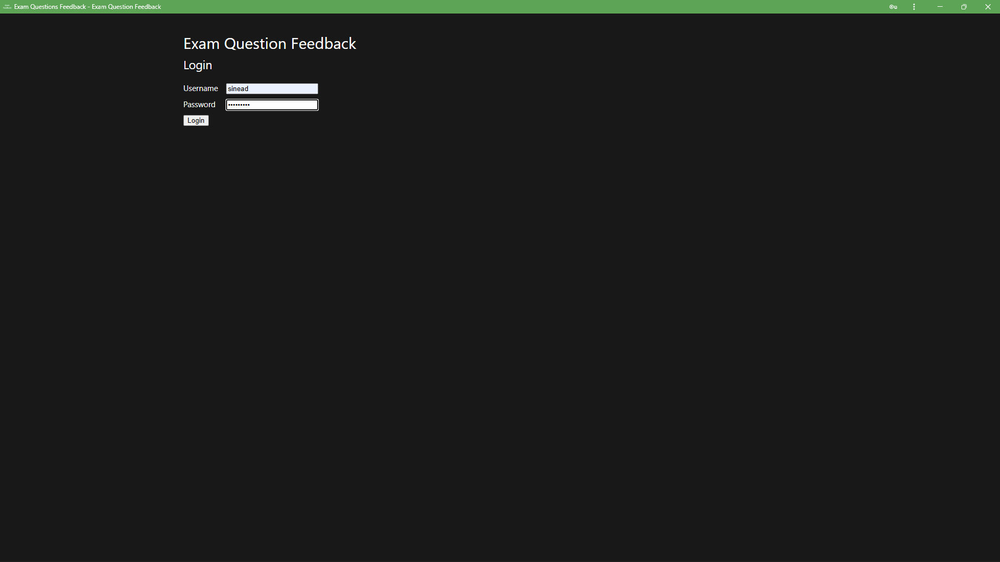
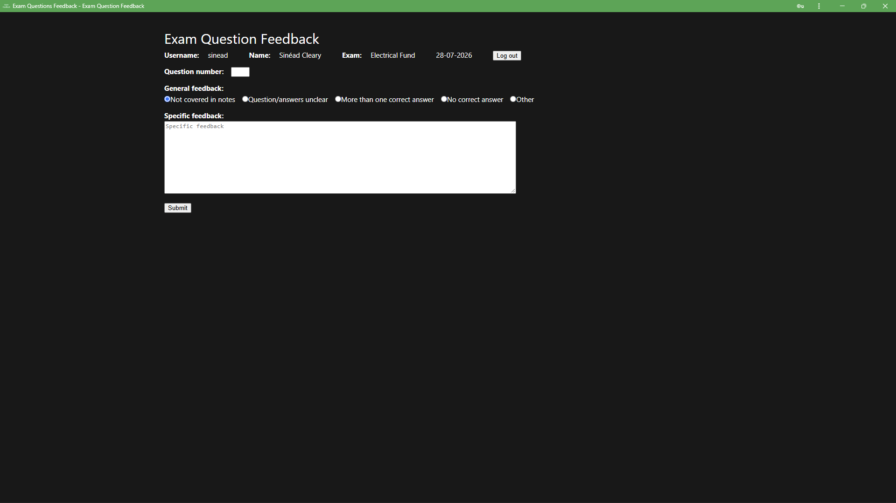

# Exam Feedback
PWA for students to submit exam question feedback if they have a problem with one or more questions.

## Features
- Login with username and password
- System checks for student's most recent exam and displays student and exam details
- Student presented with feedback form containing question number field, general feedback radio buttons, and specific feedback text area
- Submitting feedback saves it to the database

## API design
<table>
  <tr>
    <th>Method</th>
    <th>Route</th>
    <th>Description</th>
  </tr>
  <tr>    
    <td>GET</td>
    <td><code>/students</code></td>
    <td>Get all students</td>
  </tr>
  <tr>
    <td>GET</td>
    <td><code>/students/:id</code></td>
    <td>Get a student by ID</td>
  </tr>
  <tr>
    <td>POST</td>
    <td><code>/student</code></td>
    <td>Post a student</td>
  </tr>
  <tr>
    <td>POST</td>
    <td><code>/feedback</code></td>
    <td>Post feedback</td>
  </tr>
  <tr>
    <td>GET</td>
    <td><code>/feedback</code></td>
    <td>Get all feedback</td>
  </tr>
  <tr>
    <td>GET</td>
    <td><code>/exam/:id</code></td>
    <td>Get student's most recent exam</td>
  </tr>
  <tr>
    <td>POST</td>
    <td><code>/login</code></td>
    <td>Login</td>
  </tr>
</table>

## Screenshots
<table>
  <tr>
    <th>Login</th>
    <td></td>
  </tr>
  <tr>
    <th>Feedback</th>
    <td></td>
  </tr>
</table>

## Technologies used
- Vue.js
- axios
- PWA
- MySQL Workbench
- Postman

## Installation instructions
1. Clone the repository.
2. Add a `.env` file with the following:
```
PORT=8080
DB_CONNECTION_LIMIT=10
DB_HOST='localhost'
DB_USER=<your MySQL username>
DB_PASSWORD=<your MySQL password>
DB_NAME='feedback'
```
3. Run `node server.js` to start the API.
4. Navigate to `\Frontend` and run `npm run dev` to start the web app.

## References
`sw.js` based on code from https://learn.microsoft.com/en-us/microsoft-edge/progressive-web-apps/how-to/
